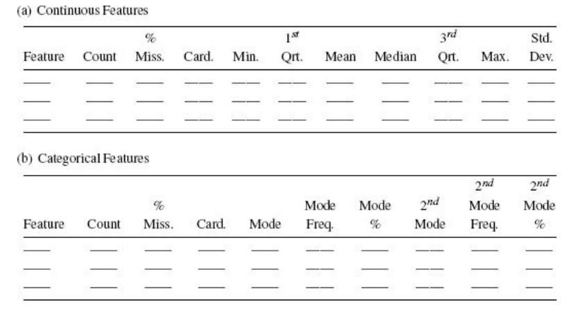
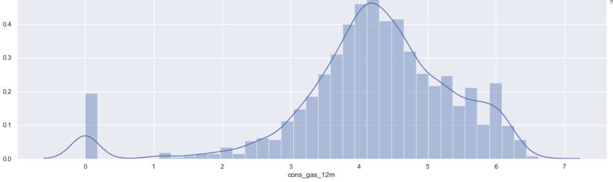
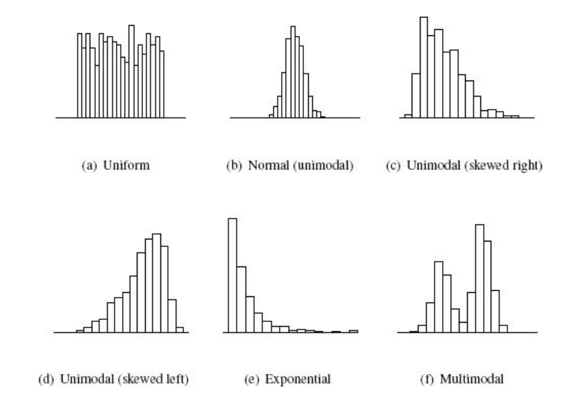
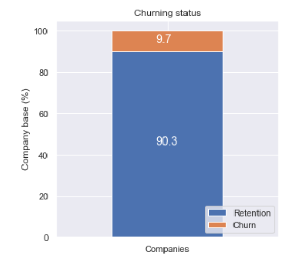
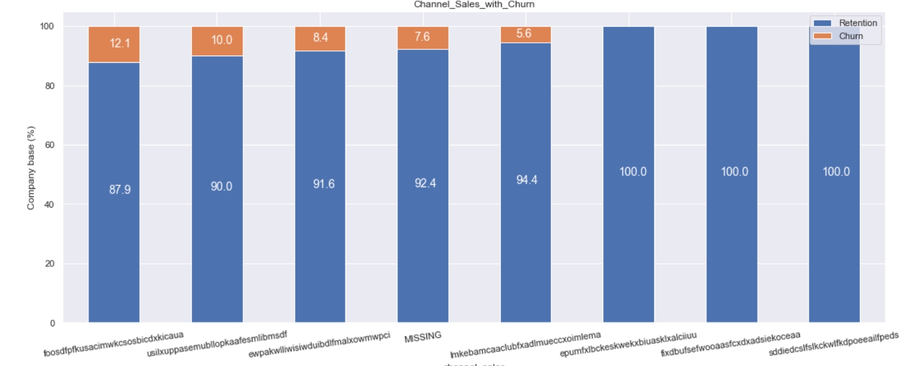
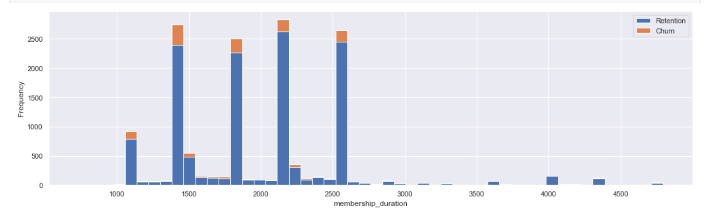

# Reference
- Fundamentals of Machine Learning for Predictive Data Analytics 2015
- Data Preparation for Machine Learning-Data Cleaning, Feature Selection, and Data by Jason Brownlee

# Goal

1. The first goal is to fully understand the characteristics of the data. It is important that for each feature, we understand characteristics such as 
    1. the types of values a feature can take(weather numerical/categorical type feature)
    2. the ranges into which the values in a feature fall
    3. how the values in a dataset for a feature are distributed across the range that they can take 
2. The second goal of data exploration is to determine whether or not the data suffer from any data quality issues that could adversely affect the models that we build. Examples of typical data quality issues include an instance that is missing values for one or more descriptive features, an instance that has an extremely high value for a feature, or an instance that has an inappropriate level for a feature. 
    1. Some data quality issues arise due to invalid data and will be corrected as soon as we discover them. 
    2. Others, however, arise because of perfectly valid data that may cause difficulty to some machine learning techniques.


# Getting to know the data: 

[Descriptive Stats and Visualization]

The most important tool used during data exploration is the data quality report. A data quality report includes:
1. **Tabular reports** (one for continuous features and one for categorical features) that describe the characteristics of each feature using standard statistical measures of central tendency and variation. 
<figure>

</figure>

2. Accompanied by data visualizations that illustrate the distribution of the values in each feature. 
	1. A histogram for each continuous feature to check for distribution.
        1. Visualization:
            ``` python
            fig, axs = plt.subplots(nrows=3, figsize=(18, 20))
            # Plot histograms
            sns.distplot((df["cons_12m"].dropna()), ax=axs[0])
            sns.distplot((df[df["has_gas"]==1]["cons_gas_12m"].dropna()), ax=axs[1])
            sns.distplot((df["cons_last_month"].dropna()), ax=axs[2])
            plt.show()
            ```
        <figure> 
        </figure>

        2. Statistical Analysis:
            1. A `uniform distribution` indicates that a feature is equally likely to take a value in any of the ranges present.
			2. Features following a `normal distribution` are characterized by a strong tendency toward a central value and symmetrical variation to either side of this central tendency. Naturally occurring phenomena—for example, the heights or weights of a randomly selected group of men or women—tend to follow a normal distribution
			3. `unimodal histograms` that exhibit skew. Skew is simply a tendency toward very high or very low values. Skewed distributions are often said to have long tails 
			4. In a feature following an `exponential distribution`, the likelihood of low values occurring is very high but diminishes rapidly for higher values. Features such as the number of times a person has been married tend to follow an exponential distribution. <span style="color:green"> 
            Recognizing that a feature follows an exponential distribution is another clear warning sign that outliers are likely </span> exponential distributions have a long tail.
			5. A feature characterized by a `multimodal distribution` has two or more very commonly occurring ranges of values that are clearly separated. Figure(f) shows a bi-modal distribution with two clear peaks—we can think of this as two normal distributions pushed together. Multimodal distributions tend to occur when a feature contains a measurement made across a number of distinct groups. For example, if we were to measure the heights of a randomly selected group of Irish men and women, we would expect a bi-modal distribution with a peak at around 1.635m for women and 1.775m for men.
            Observing a multimodal distribution is `cause for both caution and optimism`. 
                1. The caution comes from the fact that measures of central tendency and variation tend to break down for multimodal data. For example, consider that the mean value of the distribution shown in Figure(f) is likely to sit right in the valley between the two peaks, even though very few instances actually have this value. 
                2. The optimism associated with finding multimodally distributed data stems from <span style="color:green"> the fact that, if we are lucky, the separate peaks in the distribution will be associated with the different target levels we are trying to predict </span>. For example, if we were trying to predict gender from a set of physiological measurements, height would most likely be a very predictive value, as it would separate people into male and female groups.
                <figure>
                
                </figure>
    2. A stacked histogram w.r.t. the target variable to check its distribution w.r.t. target
        1. Visualization:
            ``` python
            def plot_stacked_bars(dataframe, title_, size_=(18, 10), rot_=0, legend_="upper right"):
                """
                Plot stacked bars with annotations
                dataframe: should be a (nrows x 2 column) size dataframe, with sum of column = 100 for each row
                """
                ax = dataframe.plot(
                    kind="bar",
                    stacked=True,
                    figsize=size_,
                    rot=rot_,
                    title=title_
                )

                # Annotate bars
                annotate_stacked_bars(ax, textsize=14)
                # Rename legend
                plt.legend(["Retention", "Churn"], loc=legend_)
                # Labels
                plt.ylabel("Company base (%)")
                plt.show()

            def annotate_stacked_bars(ax, pad=0.99, colour="white", textsize=13):
                """
                Add value annotations to the bars
                """

                # Iterate over the plotted rectanges/bars
                for p in ax.patches:
                    # Calculate annotation
                    value = str(round(p.get_height(),1))
                    # If value is 0 do not annotate
                    if value == '0.0':
                        continue
                    ax.annotate(
                        value,
                        ((p.get_x()+ p.get_width()/2)*pad-0.05, (p.get_y()+p.get_height()/2)*pad),
                        color=colour,
                        size=textsize
                    )
            ```
        <figure>
        
        
        </figure>

        ``` python
        def plot_distribution(dataframe, column, ax, bins_=50):
            """
            Plot variable distirbution in a stacked histogram of churned or retained company
            """
            # ------------------------- DataPreprocessing -----------------------------------
            # Create a temporal df
            temp = pd.DataFrame({"Retention": dataframe[dataframe["churn"]==0][column],
            "Churn":dataframe[dataframe["churn"]==1][column]})

            # ------------------------- Plotting ----------------------------------------
            # Plot the histogram
            temp[["Retention","Churn"]].plot(kind='hist', bins=bins_, ax=ax, stacked=True)
            # X-axis label
            ax.set_xlabel(column)
            # Change the x-axis to plain style
            ax.ticklabel_format(style='plain', axis='x')
        ```
        <figure>
        
        </figure>

    2. Statistical Analysis: